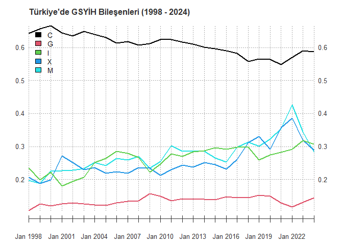

# Giriş

Ekonomide üretilen mal ve hizmetlerin toplam değeri olan gayri safi yurtiçi hasıla (GSYİH), ekonomik faaliyetin en geniş ölçüsüdür. GSYİH'yi belirlemek için bir yılda üretilen (örneğin, cep telefonlarından, otomobillerden, ders kitaplarından, Dijital içeriklerden, bilgisayarlardan, saç kesimlerinden ve pop konserlerinden) üretilen tüm mal ve hizmetlerin değerini topluyoruz. 

GSYİH'yı ölçmek için birkaç alternatif tanım ve yaklaşım vardır. İlk GSYİH tanımımız, üretilen mal ve hizmetler bakımından verilmektedir. GSYİH'yı harcama ve gelir olarak da tanımlayabiliriz: GSYİH, ekonomideki herkesin toplam geliridir ve aynı zamanda ekonomideki mal ve hizmetler için toplam harcama tutarıdır. Bu çeşitli GSYİH tanımları eşdeğerdir, çünkü bir ekonomideki toplam gelirin toplam üretime eşit olan toplam harcama miktarına eşit olması gerekir. Bu akıl yürütme sezgisel bir anlam ifade eder, çünkü ekonomide üretilen her mal veya hizmet için bir alıcı ve satıcı vardır. Mahalle berberinizdeki bir saç kesimi için 150 TL. ödemeniz durumunda, 150 TL. harcamanız, 150 TL. saç kesimini üreten berberin 150 TL. geliridir.

Ekonomik faaliyeti ve bileşenlerini ölçen bir muhasebe sistemi olan ulusal gelir muhasebesi, GSYİH ölçmenin harcama, gelir ve üretim yöntemleri arasındaki ilişkiyi gösterir. Ulusal gelir muhasebesini, ulusal gelir muhasebesinin temel özdeşliği ile ifade ederiz:

\begin{equation}\label{ch01:eq:001}
\textbf{Toplam Üretim} = \textbf{Toplam Harcama} = \textbf{Toplam Gelir}
\end{equation}

Yukarıdaki eşitlik, GSYİH hesaplanırken üç yaklaşımdan herhangi birinin - üretim, harcama veya gelir - aynı cevabı vermesi gerektiğini söylemektedir. GSYİH tanımlarımızı bu yaklaşımların her biriyle hesaplayalım.

# Harcama Yaklaşımı: GSYİH Bileşenleri

GSYİH harcama yaklaşımıyla hesaplamak tekniğini inceleyelim. GSYİH şu anda ekonomide üretilen nihai mal ve hizmetlere yapılan toplam harcamadır. Harcama yaklaşımı, harcamaların GSYH'ye ilave olan farklı bileşenleri hakkında bilgi almamızı sağlar. Ulusal gelir hesapları, harcamaları dört temel kategoriye ayırmaktadır: tüketim harcamaları, yatırım, devlet alımları (harcamalar) ve her biri sırasıyla tartışacağımız net ihracat. Ulusal gelir hesapları, milli gelir kimliğindeki GSYİH'yı belirlemek için bu dört harcama kategorisini toplamaktadır.
\begin{equation}
Y = C + I + G + NX
(\#eq:emc)
\end{equation}
Burada,
\begin{align*}
Y  &=  \text{GSYİH}, \text{toplam üretim(çıktı)},\\
C  &=  \text{tüketim harcamaları},\\
I  &=  \text{yatırımlar},\\
G  &=  \text{hükümet harcamaları},\\
NX &=  \text{net ihracat}.
\end{align*}


Table: (\#tab:GDPtable)2024 YILI GSYİH BİLEŞENLERİ (TL. Cinsinden)

|Bileşenler                    | Değerler (bin TL )|
|:-----------------------------|------------------:|
|Gayrisafi Yurtiçi Hasıla (Y)  |     30,677,665,818|
|Nihai Tüketim Harcamaları (C) |     18,034,570,201|
|Yatırımlar (I)                |      9,444,275,683|
|Hükümet Harcamaları (G)       |      4,428,497,667|
|Stoklardaki Değişme           |     -1,472,598,977|
|İhracat (X)                   |      8,831,341,079|
|İthalat (M)                   |      8,676,315,239|


Table: (\#tab:GDPtable)2024 YILI GSYİH BİLEŞENLERİ (Dolar Cinsinden)

|Bileşenler                    | Değerler (Bin Dolar ($))|
|:-----------------------------|------------------------:|
|Gayrisafi Yurtiçi Hasıla (Y)  |              858,813,186|
|Nihai Tüketim Harcamaları (C) |              504,873,049|
|Yatırımlar (I)                |              264,390,014|
|Hükümet Harcamaları (G)       |              123,974,627|
|Stoklardaki Değişme           |              -41,225,021|
|İhracat (X)                   |              247,231,071|
|İthalat (M)                   |              242,891,163|

Eşitlik \@ref(eq:emc),  makroekonomideki en temel eşitliklerden biridir ve derslerde birçok kez kullanılmaktadır. Yukarıdaki tabloda, Türkiye ekonomisinden bu dört bileşen ve bazı alt bileşenlerle ilgili 2024 verilerini göstermektedir.

## Bileşenlerin GSYİH'deki Paylarının Zaman İçindeki Değişimi


<!-- -->


Yukarıdaki şekil, 1998 - 2024 yılları arasında Türkiye'de farklı harcama bileşenlerinin GSYİH'ye oranı olarak son 26 yılda nasıl değiştiğini göstermektedir. Şekile bakıldığında açıkça ilginç gelişmeler göze çarpmaktadır. Ayrıca aşağodaki tablo da veri HTML formatı için dinamik grafik olarak yayınlanmıştır. Grafiğin üstüne gelindiğinde sağ üst köşede bütün gözlemlerin aldığı değerler okunabilmektedir.


```{=html}
<div class="dygraphs html-widget html-fill-item" id="htmlwidget-db4db42094935088d14e" style="width:672px;height:480px;"></div>
<script type="application/json" data-for="htmlwidget-db4db42094935088d14e">{"x":{"attrs":{"title":"Türkiye'de GSYİH Bileşenleri (1998 - 2024)","labels":["year","C","G","I","X","M"],"legend":"auto","retainDateWindow":false,"axes":{"x":{"pixelsPerLabel":60,"drawAxis":true},"y":{"drawAxis":true}},"stackedGraph":false,"fillGraph":true,"fillAlpha":0.1,"stepPlot":false,"drawPoints":false,"pointSize":1,"drawGapEdgePoints":false,"connectSeparatedPoints":false,"strokeWidth":1,"strokeBorderColor":"white","colors":["#66C2A5","#FC8D62","#8DA0CB","#E78AC3","#A6D854"],"colorValue":0.5,"colorSaturation":1,"includeZero":false,"drawAxesAtZero":false,"logscale":false,"axisTickSize":3,"axisLineColor":"black","axisLineWidth":0.3,"axisLabelColor":"black","axisLabelFontSize":14,"axisLabelWidth":60,"drawGrid":false,"gridLineWidth":0.3,"rightGap":5,"digitsAfterDecimal":2,"labelsKMB":false,"labelsKMG2":false,"labelsUTC":true,"maxNumberWidth":6,"animatedZooms":false,"mobileDisableYTouch":true,"disableZoom":false,"showRangeSelector":true,"rangeSelectorHeight":40,"rangeSelectorPlotFillColor":" #A7B1C4","rangeSelectorPlotStrokeColor":"#808FAB","interactionModel":"Dygraph.Interaction.defaultModel","highlightCircleSize":5,"highlightSeriesBackgroundAlpha":0.2,"highlightSeriesOpts":[],"hideOverlayOnMouseOut":false,"showRoller":true,"rollPeriod":1},"scale":"yearly","annotations":[],"shadings":[],"events":[],"format":"date","data":[["1998-01-31T00:00:00.000Z","1999-01-31T00:00:00.000Z","2000-01-31T00:00:00.000Z","2001-01-31T00:00:00.000Z","2002-01-31T00:00:00.000Z","2003-01-31T00:00:00.000Z","2004-01-31T00:00:00.000Z","2005-01-31T00:00:00.000Z","2006-01-31T00:00:00.000Z","2007-01-31T00:00:00.000Z","2008-01-31T00:00:00.000Z","2009-01-31T00:00:00.000Z","2010-01-31T00:00:00.000Z","2011-01-31T00:00:00.000Z","2012-01-31T00:00:00.000Z","2013-01-31T00:00:00.000Z","2014-01-31T00:00:00.000Z","2015-01-31T00:00:00.000Z","2016-01-31T00:00:00.000Z","2017-01-31T00:00:00.000Z","2018-01-31T00:00:00.000Z","2019-01-31T00:00:00.000Z","2020-01-31T00:00:00.000Z","2021-01-31T00:00:00.000Z","2022-01-31T00:00:00.000Z","2023-01-31T00:00:00.000Z","2024-01-31T00:00:00.000Z"],[0.6424474045514188,0.6571412981401374,0.6660410439317573,0.6451283420910237,0.6346691303836349,0.6490353026193038,0.63933314956976,0.6308365764347256,0.613989160883372,0.6175985203832345,0.6076472774084467,0.6123661420323854,0.6239313396553069,0.6241543723855347,0.6164882531033586,0.6107783887721819,0.6011172482163372,0.5971927543033378,0.590831417038201,0.5828686795990019,0.5583736838911282,0.5655083715854312,0.5639028520351902,0.5489751554969213,0.5704621348012042,0.5911553207798917,0.587872959679553],[0.1061322317682921,0.1266856216676157,0.1192865720475302,0.1264592113999094,0.1283566600650373,0.1259041885148879,0.1231520052450212,0.1218597481956367,0.1290752769982774,0.1338969047155886,0.135962925428131,0.156578594188958,0.1487455790620191,0.1360035517282222,0.1412612289089692,0.1401838471480589,0.1401997975508811,0.1380517245758822,0.1473321297414324,0.143802554185454,0.1450889192844809,0.1527094868372995,0.1499351188289282,0.1294541376821364,0.1165321282627436,0.1309785511871867,0.1443557568404528],[0.2345197552762823,0.1988029192673623,0.2221135197462041,0.1795031004839189,0.1947469576643634,0.2067814009177684,0.2517814186193915,0.2641035787228875,0.2847085480972367,0.2788764402126943,0.2665152754880762,0.2222940393888699,0.2463545877742019,0.2774404767102687,0.270584142488809,0.2834648202111494,0.2874573163793323,0.2955456639515399,0.2910823335346336,0.2985714498521936,0.297669534698953,0.2597762165740509,0.2752222921463865,0.2817245856728686,0.2916292400930604,0.3185663536265861,0.307855093621913],[0.2066622989362883,0.1881091252957071,0.1988119889377093,0.2718194187447147,0.2510511901416835,0.2300617789722045,0.2362475321588829,0.2187626756157585,0.2239483393935844,0.2188952569969976,0.2356629092896927,0.2337019914548215,0.2119413331501003,0.2299370125672194,0.24360875518714,0.2379300950495536,0.2520554170016654,0.2453127733751512,0.2308350913261304,0.2603942234543349,0.3123269623403668,0.3307421605706226,0.2912079018139223,0.3574369610633757,0.3858420218114282,0.3191583569037315,0.2878752618073111],[0.1972918078021982,0.1885400948955286,0.2247323813929248,0.2268953324762839,0.2287727501906281,0.2321891973081885,0.2520108493147218,0.2426608948514871,0.2636803712803342,0.2596129105036531,0.2698196296818875,0.2341686780086452,0.2550033190935989,0.303104743843802,0.2846992713406408,0.2873428929382585,0.2856075946744439,0.2655726626176704,0.2524467710275543,0.2972274640573412,0.3138152230817271,0.3011907684244153,0.3222296558688562,0.3533874785508405,0.4258592751355391,0.3436076901891614,0.2828218838463751]],"fixedtz":false,"tzone":"UTC","plugins":{"Crosshair":{"direction":"vertical"}}},"evals":["attrs.interactionModel"],"jsHooks":[]}</script>
```

Türkiye'de tüketim harcamaları son yirmi yıl göz önüne alındığında azalma trendi göstermektedir. Yatırımlar artma eğilimi sahiptir, ancak GSYİH'nin en volatile bileşenidir. İlerideki konularda yatırımların volatilesinin GSYİH volatilitesinin en önemli nedeni olduğu üzerinde durulacaktır. Devlet harecamaları tartışmaları açısından GSYİH oranı olarak $G$ durağan bir seyir izlemektedir. Devletin ekonomide büyüklüğü ilgili dönem itibariyle önemli bir değişim göstermemiştir. Çoğu yıllarda, net ihracat negatiftir ve Türkiye ticaret açığı vermektedir. Sadece birkaç yıl için, ticaret açığı GSYİH'nın % 5'inin üzerine çıkmıştır. Bu konuya ilerleyen bölümlerde tekrar geri dönülecektir.

<table class="table" style="margin-left: auto; margin-right: auto;">
<caption>(\#tab:table02)Summary Statistics</caption>
 <thead>
  <tr>
   <th style="text-align:left;"> Variable </th>
   <th style="text-align:left;"> N </th>
   <th style="text-align:left;"> Mean </th>
   <th style="text-align:left;"> Std. Dev. </th>
   <th style="text-align:left;"> Min </th>
   <th style="text-align:left;"> Pctl. 25 </th>
   <th style="text-align:left;"> Pctl. 75 </th>
   <th style="text-align:left;"> Max </th>
  </tr>
 </thead>
<tbody>
  <tr>
   <td style="text-align:left;"> C </td>
   <td style="text-align:left;"> 27 </td>
   <td style="text-align:left;"> 0.61 </td>
   <td style="text-align:left;"> 0.032 </td>
   <td style="text-align:left;"> 0.55 </td>
   <td style="text-align:left;"> 0.59 </td>
   <td style="text-align:left;"> 0.63 </td>
   <td style="text-align:left;"> 0.67 </td>
  </tr>
  <tr>
   <td style="text-align:left;"> G </td>
   <td style="text-align:left;"> 27 </td>
   <td style="text-align:left;"> 0.13 </td>
   <td style="text-align:left;"> 0.012 </td>
   <td style="text-align:left;"> 0.11 </td>
   <td style="text-align:left;"> 0.13 </td>
   <td style="text-align:left;"> 0.14 </td>
   <td style="text-align:left;"> 0.16 </td>
  </tr>
  <tr>
   <td style="text-align:left;"> I </td>
   <td style="text-align:left;"> 27 </td>
   <td style="text-align:left;"> 0.26 </td>
   <td style="text-align:left;"> 0.037 </td>
   <td style="text-align:left;"> 0.18 </td>
   <td style="text-align:left;"> 0.24 </td>
   <td style="text-align:left;"> 0.29 </td>
   <td style="text-align:left;"> 0.32 </td>
  </tr>
  <tr>
   <td style="text-align:left;"> CinS </td>
   <td style="text-align:left;"> 27 </td>
   <td style="text-align:left;"> 0.0083 </td>
   <td style="text-align:left;"> 0.02 </td>
   <td style="text-align:left;"> -0.048 </td>
   <td style="text-align:left;"> -0.00061 </td>
   <td style="text-align:left;"> 0.016 </td>
   <td style="text-align:left;"> 0.059 </td>
  </tr>
  <tr>
   <td style="text-align:left;"> X </td>
   <td style="text-align:left;"> 27 </td>
   <td style="text-align:left;"> 0.26 </td>
   <td style="text-align:left;"> 0.049 </td>
   <td style="text-align:left;"> 0.19 </td>
   <td style="text-align:left;"> 0.23 </td>
   <td style="text-align:left;"> 0.28 </td>
   <td style="text-align:left;"> 0.39 </td>
  </tr>
  <tr>
   <td style="text-align:left;"> M </td>
   <td style="text-align:left;"> 27 </td>
   <td style="text-align:left;"> 0.27 </td>
   <td style="text-align:left;"> 0.051 </td>
   <td style="text-align:left;"> 0.19 </td>
   <td style="text-align:left;"> 0.24 </td>
   <td style="text-align:left;"> 0.3 </td>
   <td style="text-align:left;"> 0.43 </td>
  </tr>
  <tr>
   <td style="text-align:left;"> GDP </td>
   <td style="text-align:left;"> 27 </td>
   <td style="text-align:left;"> 4264834830 </td>
   <td style="text-align:left;"> 7674419178 </td>
   <td style="text-align:left;"> 71944700 </td>
   <td style="text-align:left;"> 631564323 </td>
   <td style="text-align:left;"> 3447434912 </td>
   <td style="text-align:left;"> 30677665818 </td>
  </tr>
  <tr>
   <td style="text-align:left;"> C_NPISH </td>
   <td style="text-align:left;"> 27 </td>
   <td style="text-align:left;"> 0.0032 </td>
   <td style="text-align:left;"> 0.0004 </td>
   <td style="text-align:left;"> 0.0023 </td>
   <td style="text-align:left;"> 0.0029 </td>
   <td style="text-align:left;"> 0.0034 </td>
   <td style="text-align:left;"> 0.0041 </td>
  </tr>
</tbody>
</table>

Yukarıdaki Tabloda GSYİH bileşenlerinin betimsel istatistik değerleri verilmektedir. **CinS** değişkeni, stoklardaki değişim ve **C_NPISH** değişkeni kar amacı gütmeyen organizasyonların tüketim harcamalarını göstermektedir. Ortalama değerleri sıfıra yakındır. Bu veriler TCMB elektronik veri dağıtım merkezinden aynı altbölüm altından gelmektedir.


